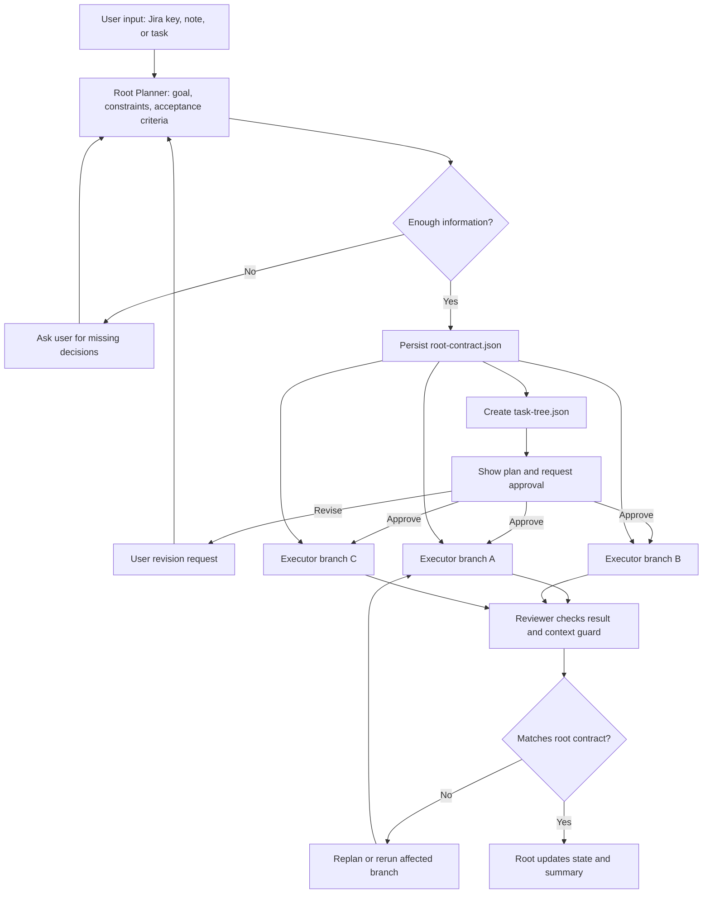

# task-loop-orchestrator

task-loop-orchestrator는 AI agent에게 개발 작업을 맡길 때 계획, 구현, 검증이 한 대화 안에서 뒤섞이는 문제를 줄이기 위한 CLI 오케스트레이터입니다.
Planner, Executor, Reviewer의 역할을 분리해 각 단계가 독립적으로 판단하게 하고, Root Orchestrator가 목표와 범위, 금지 사항, 완료 기준을 공통 기준으로 고정합니다.
사용자는 승인된 계획 안에서만 작업이 진행되도록 제어할 수 있고, 각 단계의 prompt, tool, event 기록을 통해 작업 흐름과 실패 원인을 추적할 수 있습니다.

## 핵심 원칙

### 1. 계획 승인

작업은 기존 구조 파악, 변경 후보 영역, 테스트 계획, 리스크, 금지 사항, 완료 기준을 먼저 정리한 뒤 실행해야 합니다. 사용자가 승인하기 전까지 Executor는 실행되지 않아야 합니다.

계획은 이후 실행과 리뷰의 기준이 됩니다. Executor는 승인된 계획의 범위 안에서만 작업하고, Reviewer는 결과가 그 계획을 지켰는지 검토합니다.

### 2. 역할 분리

하나의 AI agent가 계획, 구현, 리뷰를 모두 처리하면 판단 기준이 흐려지고 검증도 어려워집니다. 그래서 역할을 나눕니다.

- Gemini Planner: Jira 이슈나 사용자의 요청을 읽고 작업 계획과 하위 작업으로 정리합니다.
- Codex CLI Executor: 승인된 계획의 범위 안에서만 대상 레포를 수정하고 테스트를 실행합니다.
- OpenAI Reviewer: 구현 결과가 계획, 금지 사항, 완료 기준을 지켰는지 검토합니다.
- Root Orchestrator: 전체 목표와 지침을 유지하고, 각 단계가 같은 맥락 안에서 움직이는지 확인합니다.

### 3. 작업 추적성

AI agent 작업은 나중에 추적할 수 있어야 합니다. 사용자가 어떤 요청을 했는지, Planner/Executor/Reviewer에게 어떤 prompt가 전달됐는지, 어떤 파일을 읽었는지, 어떤 명령을 실행했는지, 어떤 흐름으로 수정이 이뤄졌는지 기록해야 합니다.

저장되는 기록은 디버깅과 재현에 필요한 핵심 정보로 제한합니다. 불필요한 원문 덤프를 기본값으로 만들지 않고, 요약과 상세 로그를 분리합니다.

### 4. 루프 엔지니어링

이 프로젝트는 단순히 Planner, Executor, Reviewer를 한 번씩 호출하는 CLI가 아닙니다. Observe, Plan, Approve, Act, Check, Feedback, Stop Condition이 분리된 작업 루프를 지향합니다.

- Observe: Jira 이슈, 사용자 요청, 대상 레포 상태, 관련 파일, 테스트 환경을 읽습니다. 이 단계에서는 수정하지 않습니다.
- Plan: Root Planner가 목표, 범위, 리스크, 변경 후보 파일, 테스트 계획, 금지 사항을 정리합니다.
- Approve: 사람이 승인하기 전까지 실행하지 않습니다.
- Act: Codex Executor가 승인된 계획 안에서만 작업합니다.
- Check: 테스트와 OpenAI Reviewer로 결과를 검증합니다.
- Feedback: 실패 원인을 계획 오류, 구현 오류, 테스트 환경 문제, 정보 부족 등으로 분류합니다.
- Stop Condition: 완료, 사용자 중단, 정보 부족, 계획 위반, 반복 실패 같은 종료 조건을 명확히 남깁니다.

긴 작업에서 LLM이 맥락을 잃지 않도록 root는 긴 대화 자체가 아니라 구조화된 context packet을 관리합니다. 하위 작업은 이 context packet을 전달받아 독립적으로 실행되고, 결과와 리스크만 root에 보고합니다.

## 구조 요약

Root Orchestrator가 필요한 이유는 긴 작업을 하나의 AI agent 대화에 계속 맡기면 처음 합의한 목표, 제외 범위, 완료 기준이 압축과 재시도 과정에서 흐려질 수 있기 때문입니다. 역할을 나누더라도 각 agent가 자기 판단만 기준으로 삼으면 서로 다른 맥락에서 계획, 구현, 리뷰를 하게 됩니다.

그래서 root는 대화 기억이 아니라 파일로 고정된 계약을 기준으로 삼습니다. 작업 전체의 목표, 지침, 금지 사항, 완료 기준을 `root-contract.json`에 저장하고, 하위 작업에는 이 계약과 자기 작업 범위만 전달합니다. 하위 작업은 결과와 리스크만 root에 보고합니다.

작업 트리는 `task-tree.json`에 저장됩니다. root는 각 branch가 단순히 끝났는지만 보지 않고, 원래 계약을 벗어났는지, 제외 범위를 건드렸는지, acceptance criteria를 충족했는지, 다른 branch의 전제를 깨지 않았는지 확인합니다.

Planner, Executor, Reviewer는 root context와 task graph를 직접 수정하지 않습니다. 각 역할은 보고서와 context delta만 반환하고, Root Orchestrator가 이를 바탕으로 승인 대기, 실행, 재계획, 재실행, 완료, 실패 같은 다음 상태를 결정합니다.



## 요구 사항

- Node.js 24 이상
- Corepack으로 활성화한 pnpm 11.x, 또는 호환되는 pnpm 설치
- 작업시킬 대상 프로젝트는 Git 저장소여야 합니다. `tlo init`은 Git 저장소가 아닌 폴더에서도 현재 디렉터리에 초기화할 수 있지만, Codex 실행은 Git worktree를 만들기 때문에 Git 저장소 밖에서는 실패할 수 있습니다.
- Codex CLI가 로컬에 설치되어 있고 로그인되어 있어야 합니다. `tlo`는 별도 Codex token을 받지 않고 로컬 `codex login` 상태를 재사용합니다.

## 설치와 실행

아직 npm에 배포하지 않았습니다. 지금은 GitHub 저장소를 clone한 뒤 pnpm으로 빌드해서 사용합니다.

```bash
git clone https://github.com/jiahlee-work/task-loop-orchestrator.git
cd task-loop-orchestrator
corepack enable
pnpm install --frozen-lockfile
pnpm run build
pnpm setup
source ~/.zshrc
pnpm add -g .
node dist/cli.js --help
node dist/cli.js --version
```

이후 다른 로컬 프로젝트에서는 `tlo` 명령으로 실행합니다.

```bash
cd /path/to/your-git-project
tlo --help
tlo doctor
```

## MVP 범위

MVP에서 확인하는 것은 다음 흐름입니다.

- 프로젝트 초기화: `init`
- 로컬 설정 진단: `doctor`
- Jira MCP 기반 이슈 읽기
- Gemini Planner 기반 root plan과 task tree 생성
- 사용자 승인 또는 수정 요청
- 승인 후 대상 레포의 Git worktree에서 Codex CLI Executor 실행
- OpenAI Reviewer 기반 결과 검토
- prompt, tool, event log 기반 추적성 확보
- 저장된 run 조회와 이어 실행: `status`, `resume`

반대로 아래 작업은 현재 MVP 범위가 아닙니다.

- 임의 shell 명령 실행
- 브랜치 생성, 커밋, 푸시
- GitHub PR 생성, 머지, 릴리스
- npm publish
- Jira/GitHub 쓰기 API 연동

`checkpoint`, `checks`, `pr-plan`, `approve-pr`, `pr-exec`, `execution-audit`, `write-readiness`, `write-runner` 같은 명령은 고급 진단 또는 dry-run 경계로 남겨 둔 기능입니다. 첫 설치와 기본 루프 확인에는 필요하지 않습니다. 특히 `write-runner`는 shell, git, GitHub 명령을 실행하지 않으며 PR, 태그, 릴리스를 만들지 않습니다.

## 앞으로의 우선순위

MVP는 "설치해서 대상 레포에서 실제 계획 승인 루프를 돌릴 수 있는가"를 기준으로 좁게 잡습니다. 우선순위는 다음 순서입니다.

1. `tlo run`의 상태를 루프 단계에 맞게 정리합니다. 계획 생성, 승인 대기, 실행 중, 리뷰 중, 수정 필요, 완료, 실패를 구분해 사용자가 지금 무엇이 끝났는지 알 수 있게 합니다.
2. 승인 게이트를 강화합니다. Gemini가 만든 root plan과 task tree를 보여주고, 사용자가 `y`를 입력하기 전에는 Codex Executor가 실행되지 않게 합니다. `n`을 입력하면 수정 요청을 받아 계획을 다시 만듭니다.
3. Root context packet을 저장합니다. 전체 목표, 지침, 금지 사항, 완료 기준을 구조화해 하위 작업마다 같은 맥락을 전달하고, 하위 작업 결과가 root 지침을 벗어났는지 확인합니다.
4. Codex CLI Executor를 실제 작업 흐름에 맞게 단단하게 만듭니다. 대상 레포의 isolated worktree에서 승인된 범위만 수정하고, 실행한 명령과 변경 파일을 tool log로 남깁니다.
5. OpenAI Reviewer가 테스트 결과, diff, 완료 기준, 금지 사항 위반 여부를 검토하게 합니다. 실패하면 원인을 분류하고 다시 계획 또는 실행 단계로 되돌릴 수 있어야 합니다.
6. run 기록을 정리합니다. 기본 요약은 작게 유지하고, prompt log, tool log, event log는 문제 추적에 필요한 정보만 분리해서 저장합니다.
7. 위 흐름이 안정화된 뒤에만 GitHub PR, 커밋, 푸시, Jira 상태 변경 같은 쓰기 기능을 별도 승인 모델로 검토합니다.

## 문서

- 빠른 시작: [docs/quickstart.md](docs/quickstart.md)
- 명령어 전체 목록: [docs/commands.md](docs/commands.md)
- Root 계획 트리 모델: [docs/design/root-planning-tree.md](docs/design/root-planning-tree.md)
- JSON 출력 계약: [docs/json-output.md](docs/json-output.md)
- JSON schema: [schemas/cli-json.schema.json](schemas/cli-json.schema.json)
- 릴리스 점검표: [docs/release-checklist.md](docs/release-checklist.md)
- 릴리스 준비 요약: [docs/release-readiness.md](docs/release-readiness.md)
- 이후 작업 후보: [docs/roadmap.md](docs/roadmap.md)
- 변경 내역: [CHANGELOG.md](CHANGELOG.md)
