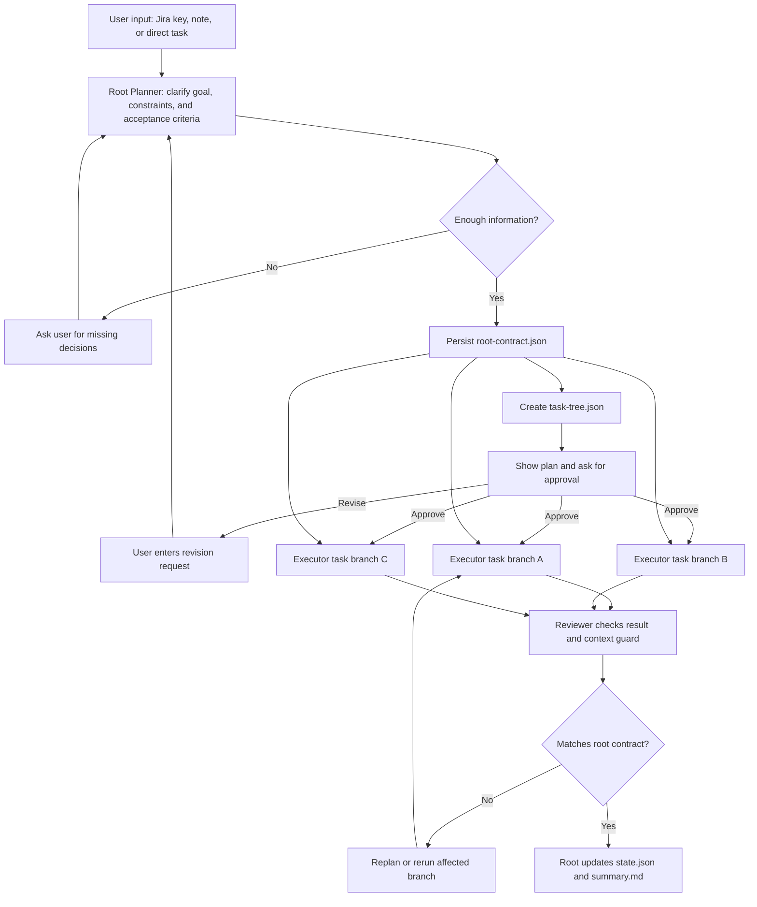

# Root Planning Tree Model

Status: design draft with initial run directory artifact storage and Gemini root-contract/task-tree output implemented. This document defines the intended planning model for the real Gemini Planner, Codex Executor, and OpenAI Reviewer loop. The current storage layer writes `root-contract.json`, `task-tree.json`, `state.json`, and `summary.md`; Gemini Planner now requests `rootContract` and `taskTree` JSON and preserves those artifacts in run state. This does not mean the full tree executor is implemented.

## 왜 필요한가

긴 작업을 하나의 LLM 대화에서 계속 처리하면 대화가 압축되면서 처음에 합의한 목표, 제한 사항, 완료 기준을 잃을 수 있다. 이 오케스트레이터는 그 문제를 줄이기 위해 root가 전체 기준을 고정하고, 세부 작업은 그 기준을 매번 주입받아 별도 실행 단위로 처리하는 구조를 목표로 한다.

핵심 원칙은 다음과 같다.

- LLM의 대화 기억에 의존하지 않는다.
- root가 만든 계약 문서를 파일로 고정한다.
- 각 세부 작업에는 root 계약과 자기 작업 범위만 넘긴다.
- root는 실행 결과가 원래 계약을 벗어나지 않았는지 계속 확인한다.
- 저장되는 run 기록은 재개와 검토에 필요한 핵심 정보만 남긴다.

## 입력 형태

`tlo run`은 세 가지 입력을 모두 지원해야 한다.

```bash
tlo run OUC-10
tlo run OUC-10 --note "기존 UI는 유지하고 내부 구조만 정리해줘"
tlo run "채팅 Sidebar 구조를 리팩터링해줘"
```

- Jira issue key만 있으면 Jira 이슈 본문을 읽어 Planner에 넘긴다.
- `--note`가 있으면 Jira 이슈 내용에 사용자의 추가 지시를 붙인다.
- Jira issue key가 없으면 사용자가 입력한 문장을 직접 작업 설명으로 사용한다.

## Root의 책임

Root는 계속 대화하는 LLM 스레드가 아니라, 상태를 관리하는 컨트롤러에 가까워야 한다. LLM 호출은 필요한 순간에만 짧게 수행하고, 판단에 필요한 기준은 파일로 저장된 계약 문서에서 다시 읽는다.

Root가 맡아야 하는 일은 다음과 같다.

- 전체 목표를 정리한다.
- 작업 범위와 제외 범위를 구분한다.
- 반드시 지켜야 할 지침을 고정한다.
- 완료 기준과 검증 기준을 정한다.
- 작업을 트리 구조로 나눈다.
- 각 Executor 호출에 root 계약을 주입한다.
- Reviewer 결과를 보고 root 계약 위반 여부를 확인한다.
- 실패하거나 맥락을 벗어난 작업은 다시 계획하거나 재실행한다.

Root가 목표, 지침, 완료 기준을 확정하기에 정보가 부족하면 바로 실행하지 않고 사용자에게 질문해야 한다. 예를 들어 Jira 이슈가 모호하거나, UI 변경 허용 여부가 불명확하거나, 검증 명령이 정해져 있지 않으면 먼저 확인한다.

## 저장 구조

run 상태는 하나의 큰 JSON에 모든 원문과 로그를 넣지 않는다. 재개와 검토에 필요한 최소 정보만 run 디렉터리에 나눠 저장하는 형태를 목표로 한다.

```text
.orchestrator/runs/run_xxx/
  root-contract.json
  task-tree.json
  state.json
  summary.md
```

`root-contract.json`에는 잃어버리면 안 되는 기준만 둔다.

```json
{
  "goal": "...",
  "nonGoals": ["..."],
  "mustFollow": ["..."],
  "acceptanceCriteria": ["..."],
  "contextGuard": ["..."],
  "repoConstraints": ["..."],
  "userDecisions": ["..."]
}
```

`task-tree.json`에는 실행 단위와 의존성을 둔다.

```json
{
  "tasks": [
    {
      "id": "task_1",
      "title": "...",
      "dependsOn": [],
      "status": "pending"
    }
  ]
}
```

`state.json`에는 현재 진행 상태, 마지막 결과 요약, 실패 이유, 다음에 해야 할 일을 둔다. Gemini 원문 전체 응답, 긴 터미널 출력, provider 디버그 정보, Jira raw payload, 내부 reasoning은 기본 저장 대상이 아니다. 필요하면 별도 debug 모드에서만 저장한다.

## 실행 흐름



## Context Guard

Root는 각 하위 작업이 단순히 완료됐는지만 보지 않는다. 다음 항목도 확인해야 한다.

- 원래 목표와 다른 방향으로 구현하지 않았는가
- 제외 범위로 둔 작업을 건드리지 않았는가
- 사용자가 명시한 지침을 어기지 않았는가
- acceptance criteria를 충족했는가
- 테스트나 검증 명령 결과가 신뢰 가능한가
- 한 branch의 변경이 다른 branch의 전제를 깨지 않았는가

이 검사는 Reviewer의 보고서와 실제 diff/test evidence를 함께 사용해야 한다. Reviewer가 pass를 반환해도 root 계약을 위반하면 해당 branch는 완료로 처리하지 않는다.

## 구현 순서

1. `tlo run <jiraKey> --note "..."`와 `tlo run "직접 작업 설명"` 입력을 안정화한다.
2. Gemini Planner 결과를 root contract와 task tree로 나누어 저장한다.
3. 계획 승인 UX에서 `n`을 입력하면 사용자가 수정 요청을 직접 입력하고 다시 계획하도록 한다.
4. run 저장 구조를 핵심 파일 중심으로 축소한다.
5. Codex Executor에는 항상 root contract와 해당 task만 전달한다.
6. OpenAI Reviewer가 diff, test evidence, acceptance criteria, context guard를 함께 검토하게 한다.
7. Root가 Reviewer 결과를 받아 branch 완료, 재실행, 실패, 사용자 확인 필요 상태를 결정한다.
